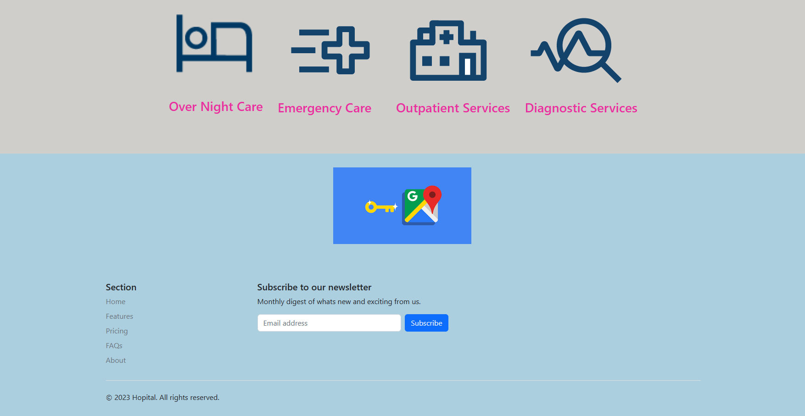

# Description
Hospital Web App with NLP-based Disease Search Engine and Doctor Recommendation

We have developed a comprehensive and innovative hospital web application aimed at enhancing the healthcare experience for patients. Our app combines cutting-edge technology, natural language processing (NLP), and advanced recommendation algorithms to provide efficient disease search capabilities and personalized doctor recommendations.

Key Features:

NLP-based Disease Search Engine: Our web app incorporates a powerful NLP-based disease search engine that allows users to input their symptoms, medical conditions, or keywords in natural language. The system intelligently analyzes and interprets the user's query, accurately identifying relevant diseases from a vast medical database.

Accurate Disease Information: Upon entering their query, users receive comprehensive and reliable information about the identified disease. The app presents details such as disease name, prevalence, risk factors, symptoms, treatments, and preventive measures, ensuring users have access to valuable insights.

Doctor Recommendation System: Understanding the importance of finding the right healthcare professional, our app employs advanced recommendation algorithms to match patients with suitable doctors. By considering factors like disease specialization, expertise, location, patient reviews, and availability, the system provides personalized recommendations tailored to each user's specific needs.

User-Friendly Interface: The web app offers a user-friendly interface, making it easy for patients to navigate, search for diseases, and explore recommended doctors. The intuitive design ensures a seamless user experience, facilitating quick and efficient access to essential healthcare information.

Data Security and Privacy: We prioritize the security and privacy of user data. Stringent measures are in place to protect sensitive information, ensuring compliance with industry-standard data security practices and regulations.

Benefits:

Empowers patients: The app empowers patients by equipping them with accurate disease information, enabling them to make informed decisions about their health.

Personalized recommendations: Patients receive tailored doctor recommendations based on their specific disease and individual preferences, enhancing the chances of finding the most suitable healthcare provider.

Time and resource optimization: By leveraging advanced technologies, the app streamlines the disease search process and reduces the effort required to find appropriate doctors, saving valuable time and resources for patients.

Improved healthcare outcomes: The app contributes to improved healthcare outcomes by facilitating early disease identification, access to relevant information, and connecting patients with skilled healthcare professionals.

Overall, our hospital web app revolutionizes the healthcare experience by combining state-of-the-art NLP techniques, disease search functionality, and intelligent doctor recommendations. With this innovative solution, patients can confidently navigate the complexities of their health concerns, find accurate disease information, and connect with the right doctors for optimal care.

# Getting Started with Hospital
This MERN Stack based web application for Hospitals.

## Available Scripts
In the project directory, you can run:

### `npm start`

Runs the app in the development mode.\
Open [http://localhost:3000](http://localhost:3000) to view it in your browser.

